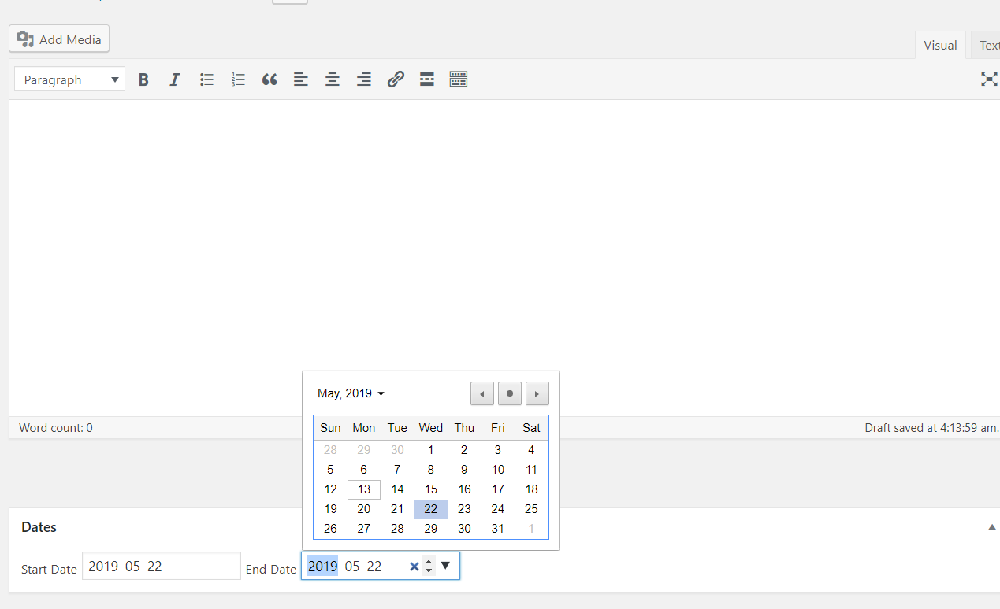
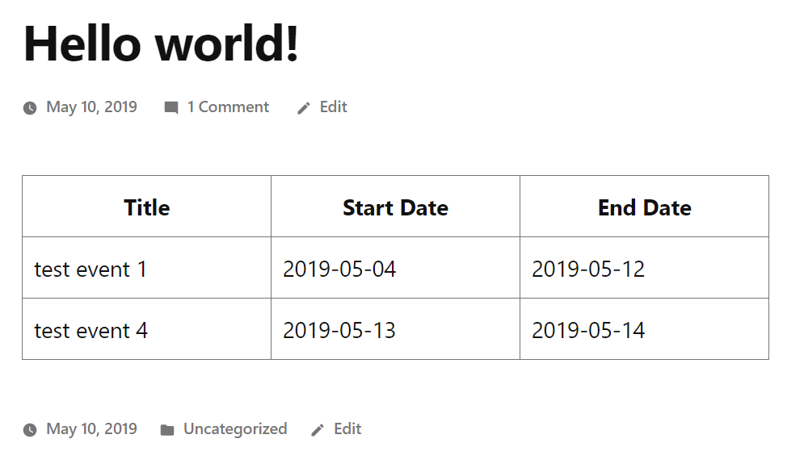

WordPress Event Plugin
======================

Please create a simple plugin that registers a custom post (ex. Events), a corresponding category (ex. Event Types), registers a metabox with a couple fields (ex. Start Date and End Date). The plugin should also create a shortcode that can be used to display a listing of all the posts of the created post type.

- [x] Create Events plugin
- [x] Register Events custom post
- [x] Enable Event category
- [x] Create Metabox for start and end date
- [x] Shortcode [list-events] that lists all events

### Installation Instructions

* Download the zip file into a local folder
* From your WordPress dashboard, visit plugins > Upload Plugin
* You're done!

Requires at least: 4.9.8
Tested up to: 5.1.2
Gutenberg compatible: yes

### Usage Instructions

* Click on the events tab on the left and add new event
* Use the shortcode [list-events]

### Any decisions you made that weren't straightforward

- I wasn't totally sure how the user will enter the shortcode on the gutenberg editor
- Usually in the old editor, I would create a custom button on the tiny mce editor and the
user just has to click on the button and the shortcode will be automatically added.

### Any unforeseen issues you encountered

- Creating shortcode buttons on the previous TinyMCE editor used to be straightforward but with the new Gutenburg editor, it is more challenging to add a button that adds the shortcode automatically.

### Any items left unfinished, and/or a wishlist for improvements

Wishlists
- [ ] Add a button to the Gutenburg editor that when clicked, will add the shortcode automatically. Currently user has to add shortcode block and type in "list-events" shortcode manually
- [x] Save date entered into metabox as unix timestamp instead of string (to enable sorting)
- [ ] Add validation for date end (End date must be after start day)
- [ ] Add feature where deleting the plugin will delete all metavalues and posts related to the Events plugin